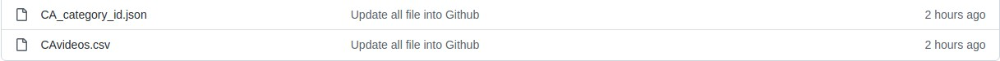
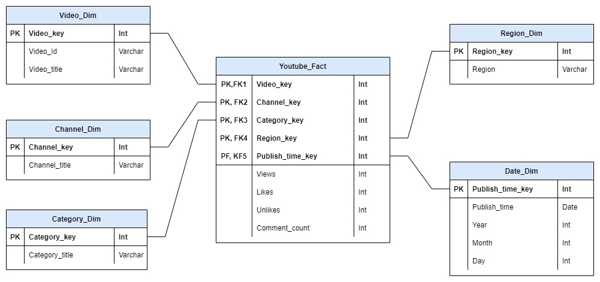
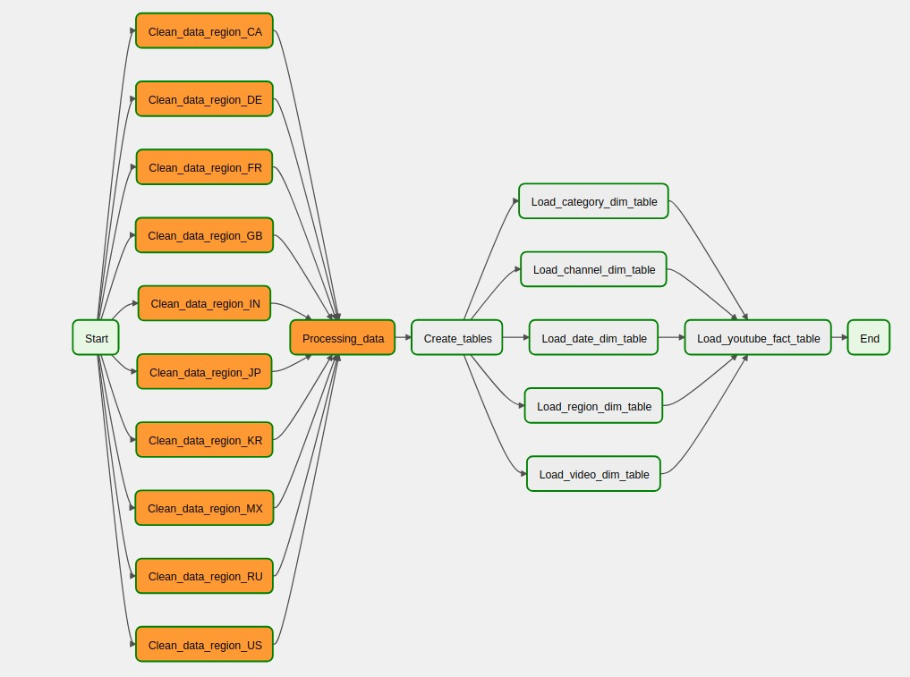

## Description
This repo provides the ETL, to ingest youtube's data into a data warehouse. The pipline will be run on a daily, scheduled using Airflow

* The purpose of this data warehouse is to help Youtube to find out which topics are most interested, which videos are most interacted in right now, based on views, likes, disliked
* This will be helpful in enabling Youtube rech some of its analytical goals, make some bussiness decision that will improve user experiences.
## Dataset
* The dataset is a daily record of the top trending Youtube videos. It includes several months (and counting) of data on daily trending Youtube videos. Data is included for the US, GB, CA, FR, RU, MX, KR, JP and IN regions (USA, Greate Britain, Germany, Canada, France, Russa, Mexico, South Korea, Japan and India respectively), with up to 200 listed trending videos per day.

* Each regions's data is in a separate file. Data includes the video title, channel title, publish time, tags, views, likes and dislikes, description, and comment count.
* The data also includes a catagory_id field, which varies between regions. To retrieve the categories for a specific video, find it in the associated JSON. One such files is included for each of regions in the dataset
## Data warehouse design
* For the schema design, the STAR schema is used as it simplifies queries and provides fast aggregations of data

* There are 2 types of data involved, videos.csv and category_id.json. These two files will be join together to find the corresponding category_title and then we extract informations and load it into dim and fact tables
## ETL Pipeline

